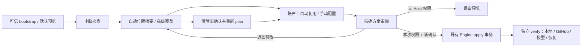

# Setup V2 施工与能力边界 1.0.0

Work: [#132](https://github.com/youling/ai-use/issues/132)；基线 `8cf0457e853b30148257860db7e306b0a640b56e`。遵循既有 HOST_AGENT V1、SetupEngine 和 Windows Adapter；不新增安装系统、常驻服务或身份管理平面。

## 消费既有能力

| 既有 owner / 实现 | 可复用能力 | 不能从中推断的能力 |
| --- | --- | --- |
| bootstrap.ps1 / PR131 | PSF 签名 Python 发现、官方 hash、隔离 venv、显式 Host apply 入口 | 自动系统升级或授权安装 |
| SetupEngine | probe/plan/apply/verify/repair/rollback、marker/journal/lease、digest/hash currentness | 用户勾选即凭据成功、已有目录自动归属 |
| Windows inventory / Known Folder | 物理盘/volume、WSL 应用、WSLC metadata、Documents | WSLC `ps` 即完整 runtime canary、OneDrive 即私有 durable owner |
| project_github.py | owner 绑定的短期 GitHub App 投影与撤销 | 通用 OAuth/现有账号自动导入、setup status 协议 |
| github_credential.py | 每次操作验证 expiry/repo/Work/权限后消费已投影 credential | Host 登录发现或凭据 custody |
| Windows credential manager / gh | 可以存在 Host 登录线索 | 跨进程/容器可移植性与授权、模型就绪 |
| 原生模型 provider / OpenCode | Host vendor 管理自身登录与 state | 允许读取、复制或共享 auth.json / cookie / DB |
| 已发布 OCI digest | 公开不可变 OpenCode runtime | 新发布、稳定推广或 production deployment 权限 |

## 受约束的 credential seam

UI 只接收账户/提供商、能力、reason code 和 next action 的非敏感元数据；不让普通用户输入 helper、Work 或引用字符串。自动模式先判断可安全复用与缺失能力；手动模式走可信 Host owner 的授权流程。没有适配器的类别明确返回 `REUSE_NOT_SUPPORTED` / 需连接，用户可以暂时跳过。

owner 适配器提供的授权不等于安装器建立第二身份平面。真实连接要验证源、范围、生命周期和当前授权；scope 错误、过期、撤销、假登录与部分成功不能晋升完整 READY。公共 fixtures 只证明代码分支，不证明现实认证。

## staged local profile 与完整 Agent

本次 Architect dispatch 明确允许缺 GitHub、模型和 private durable 权限时完成基础安装。现有完整 Agent 的恢复与认证 contract 继续有效：本地受限 staging 不宣称完整 Agent 已启用，不向其授予 GitHub/model 权限。launcher 的显式 local-only profile 复用同一 launch/owner/exchange/不可变 image 路径，以非 root、禁止外部网络、认证边界隔离运行。

后续完整网络化 Agent 仍需 Host-projected identity、模型证明、私有 durable writeback/fresh readback 和具体 Host authority；不从本地安装状态自动升级。端口/原生 state/未知 owner 保留或阻塞，不停止旧 OpenCode。

## 验证与回滚

采用 Windows/Linux synthetic engine/adapter/credential/Pilot 回归、窄终端与长路径界面证据；最终 PR 固定 exact head 后完成 CI 并交给 Architect。现有事务由 owner ledger 限定回滚；唯一数据、未知锁和旧 runtime/state 不清理。代码可以经普通 reviewed revert 撤销，真实 Host apply 不在本轮施工权限中。
