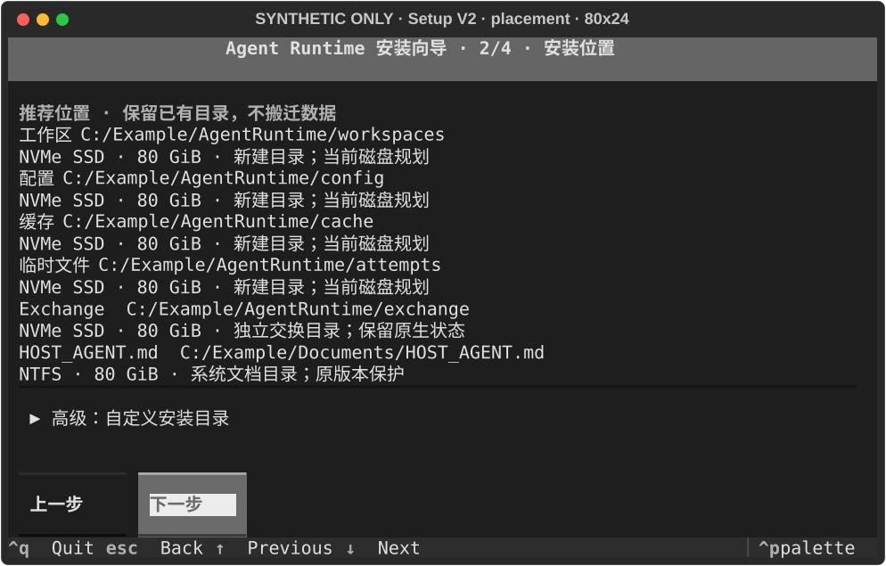
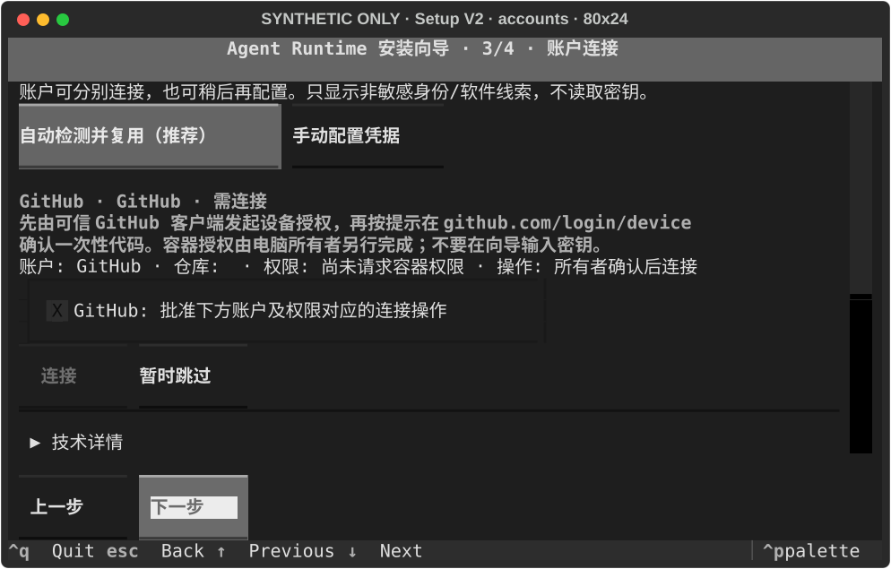
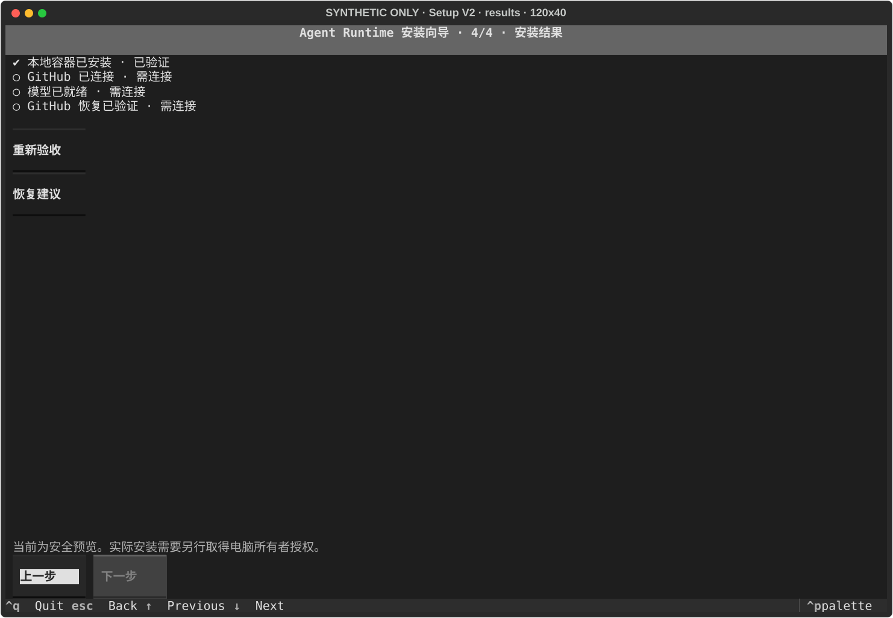

# 安装向导 V2：先查看，再安装

这是 [#132](https://github.com/youling/ai-use/issues/132) 的公共源码候选。独立审查与真实电脑验收分别进行；测试通过不代表已经替你安装或连接账号。

## 第一次打开

从可信来源下载并解压已审查版本的 ai-use，进入解压目录。在 PowerShell 7 中运行：

```powershell
pwsh -NoProfile -File .\agent-runtime\setup\bootstrap.ps1 -Prepare
```

它准备该解压目录专属的 Python 依赖环境，并打开预览向导。需要 Windows AMD64、PowerShell 7 和经过 PSF 签名验证的 Python 3.14；不需要 Git、Codex 或 OpenCode。缺少这些前提时入口会停止，不能将此版本称为零前提的一键安装包。PowerShell 5.1 的直接入口属于独立后续工作；不要绕过来源或签名检查来启动。

只检查，不准备依赖环境：

```powershell
pwsh -NoProfile -File .\agent-runtime\setup\bootstrap.ps1 -CheckOnly
```

Python 缺失时，先阅读 [既有启动说明](README.md) 的官方来源、安装位置和验证边界；安装官方隔离运行时需要另外明确批准。安装容器还要求 WSL **应用**至少 3.0、WSLC 可用和足够空间。向导不会替你升级 WSL 或重启。

## 四阶段操作

1. **电脑检查**：查看系统、Python、WSL 和存储状态。展开诊断后可看技术信息；按失败项的建议处理。
2. **安装位置**：接受自动推荐，或展开高级自定义。摘要展示最终工作区、配置、缓存、临时文件、Exchange 和 HOST_AGENT 路径。高速本地盘优先，已有目录保持原位置；不会搬迁已有 OpenCode 或用户数据。
3. **账户连接**：选择“自动检测并复用已有凭据”或“手动配置凭据”。GitHub 和模型分别处理，可以暂时跳过。发现登录软件或账号线索不等于容器已获得权限；不能安全复用时会显示需要连接。当前默认适配器只探测软件存在，只有已注册的可信 owner 适配器才能提供账户元数据。不要在向导、聊天或诊断中粘贴任何密钥。
4. **预览与结果**：审阅实际变更，分别查看本地安装、GitHub、模型和完整恢复四项状态。任何一项成功都不能替代另外三项。

Tab / 方向键移动焦点，回车选择，Esc 返回，Ctrl+Q 退出。返回修改方案会取消旧确认。

默认入口是预览。只有本机所有者具备并授予本次实际安装权限时，才使用：

```powershell
pwsh -NoProfile -File .\agent-runtime\setup\bootstrap.ps1 -Prepare -AuthorizeHostApply
```

这只解锁审阅后的安装操作；仍需在向导确认当前方案。不要让另一个 Agent 代替你点击实际安装授权。

## 账户连接的边界

现有 `project_github.py` 可以由 Host owner 按绑定生成短期、仓库范围受限的 GitHub App 投影，并撤销它；它需要 owner 保管的绑定和密钥，不是普通用户的 OAuth 登录接口。容器内的 `github_credential.py` 只消费已批准投影，不会发现、导入或保存 Host 身份。

原生凭据管理器、`gh` 登录或模型应用的登录文件都不是可直接共享的凭据证明。本版不提取 OpenCode `auth.json`、cookie 或会话数据库。没有经过 owner 批准的适配器时，自动复用和手动授权会明确给出连接建议，而非假称已经认证。真正 OAuth、密钥接收和投影仍须由受信任的 Host custody 路径完成；原始凭据不进入安装检查点、HOST_AGENT、GitHub 或命令参数。

GitHub 设备授权要先由可信客户端发起，取得一次性代码，再在客户端提示的官方页面确认；仅打开设备页面不能开始登录。[GitHub CLI 官方登录说明](https://cli.github.com/manual/gh_auth_login) 描述了浏览器流程和系统凭据保管，也明确说明凭据存储不可用时可能回退为明文文件。因此本安装器不会自动执行该登录，更不会将一次 Host 登录视为容器已连接。

基础安装会启动受限的本地验证容器：禁止外部网络、没有宿主端口映射、使用独立受保护的临时服务器认证。本地检查通过仍不代表可以从宿主浏览器使用、联网推理或操作 GitHub。连接适配器及完整认证需要后续验收；HOST_AGENT 的完整 Agent 启用条件不会被基础安装绕过。

## 界面预览

以下是实际 Textual 渲染的合成界面，不是实机安装证据。路径、账号和能力状态均为测试数据：







开发者可重复运行 `python scripts/capture_v2.py --output-dir evidence`；无需宿主探测、网络或真实凭据。Windows/Linux CI 也生成对应 exact head 的界面 artifact。[结构与能力边界](V2_DESIGN.md) 解释 V1 → V2 的复用关系。

## 恢复与剩余验收

中断时重新检查并查看修复方案；保留检查点与未知目录，不能自行删除锁或用户文件。安装、恢复和撤销沿用既有 SetupEngine 事务及 owner 证明。已运行的容器需先通过归属验证的停止流程才能撤销其资源。

公开 CI 与界面截图使用合成数据。真实 Windows 安装、Host 凭据适配器、模型认证及私有 GitHub 冷启动恢复需要分别授权并留证；本 PR 不发布新镜像、不自行合并、不操作生产环境。
