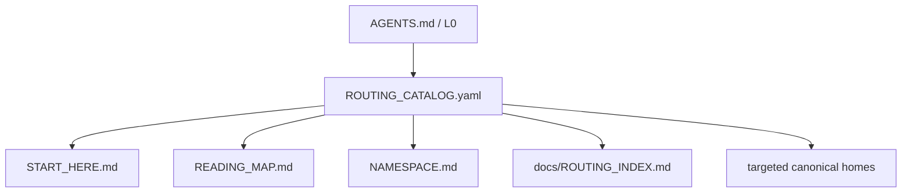

# Routing Index — DERIVED

<!-- Generated by tools/routing.py; edit ROUTING_CATALOG.yaml. -->

来源：[ROUTING_CATALOG.yaml](../ROUTING_CATALOG.yaml) · schema 1.0.0。

只拥有 scene/applicability、reading trigger、canonical-home 与 projection/compatibility metadata；不拥有 authority、scope/acceptance、private topology、live project facts 或 protocol mechanics。

执行/恢复/接管的第一份 normative rules 是 current governance repo 的 AGENTS.md；BOOT-1 可先做纯寻址。

箭头表示 routing/projection，不表示 authority 或执行顺序。

| ID / reading level | 角色与场景 | Canonical home |
| --- | --- | --- |
| `kernel` / L0 | all；execution / recovery / takeover 的第一份 normative rules | [AGENTS.md](../AGENTS.md) |
| `language` / L2 | all；Human-facing language / override 存在歧义 | [00_KERNEL/LANGUAGE_POLICY.md](../00_KERNEL/LANGUAGE_POLICY.md) |
| `bootstrap` / L2 | all；startup / recovery / access / live-state gate | [10_BOOT/BOOTSTRAP_CHECK_PROTOCOL.md](../10_BOOT/BOOTSTRAP_CHECK_PROTOCOL.md) |
| `local-engineering-gate` / L2 | all；本地 / 本地+设备或明确依赖 local toolchain 的 execution preflight | [10_BOOT/LOCAL_ENGINEERING_GATE.md](../10_BOOT/LOCAL_ENGINEERING_GATE.md) |
| `workspace` / L2 | Global Architect/Human；仅 workspace 初始化 / role registration；普通项目执行不触发 | [10_BOOT/WORKSPACE_BOOTSTRAP_PROTOCOL.md](../10_BOOT/WORKSPACE_BOOTSTRAP_PROTOCOL.md) |
| `roles` / L2 | all；current role / authority boundary 尚不明确 | [CONSTITUTION.md](../CONSTITUTION.md) §2 |
| `execution` / L2 | all；mutation / workspace hygiene、DIRECT/DELEGATE、dispatch / review / repair / continuation / completion / Maintenance Lane | [docs/AGENT_INTERFACE.md](AGENT_INTERFACE.md) §1–4 |
| `recovery` / L2 | all；planned transfer / crash takeover / old context unavailable / hot or warm resume；context modes / independence / delegation | [30_PROTOCOLS/RECOVERY_HANDOFF.md](../30_PROTOCOLS/RECOVERY_HANDOFF.md) §1–5 |
| `trace` / L2 | all；事实价值行为 / checkpoint / durable recovery evidence | [30_PROTOCOLS/DURABLE_TRACE_PRINCIPLE.md](../30_PROTOCOLS/DURABLE_TRACE_PRINCIPLE.md) |
| `change` / L2 | Architect/Builder/Research/Repair；文档即代码、代码/文档变更分级、Issue/ADR/PR、repo-wide migration / bulk refactor；Builder/Research/Repair 仅派单要求治理 artifact 时 | [30_PROTOCOLS/CHANGE_LIFECYCLE.md](../30_PROTOCOLS/CHANGE_LIFECYCLE.md) §3–4.1 |
| `owner-instance-boundary` / L2 | all；semantic owner / storage / private instance-overlay / pointer-projection / secret reference-value 边界需要判断；仅按当前任务相关范围读取 | [30_PROTOCOLS/OWNER_INSTANCE_BOUNDARY.md](../30_PROTOCOLS/OWNER_INSTANCE_BOUNDARY.md) |
| `github-native-first` / L2 | Architect；提出自建 GitHub-hosted collaboration/control/work/release/event/read/query/navigation/metadata subsystem，或 material architecture 依赖 GitHub platform behavior；普通 bugfix / Hot Resume / 确定性维护 / 已冻结窄实现不触发 mandatory scan | [30_PROTOCOLS/GITHUB_NATIVE_FIRST.md](../30_PROTOCOLS/GITHUB_NATIVE_FIRST.md) |
| `diagram` / L2 | Architect/Builder/Research/Repair；复杂 topology / workflow / sequence / lifecycle / diagram drift；Builder/Research/Repair 仅派单要求 diagram 时 | [30_PROTOCOLS/DIAGRAM_AS_CODE.md](../30_PROTOCOLS/DIAGRAM_AS_CODE.md) |
| `data` / L2 | all；durable business data / data model / schema migration | [docs/DURABLE_DATA_DOCTRINE.md](DURABLE_DATA_DOCTRINE.md) |
| `reproducibility` / L2 | all；恢复项目所需 setup / runtime / fixture / reproducibility contract | [30_PROTOCOLS/RECOVERY_HANDOFF.md](../30_PROTOCOLS/RECOVERY_HANDOFF.md) §7 |
| `reconnaissance` / L2 | Architect；Fresh/takeover material architecture、new domain / major pivot；成熟项目拟引入 external runtime/framework/subsystem；普通 hot resume / 小 bug / 确定性维护不机械重做 ARCH-0 | [docs/ARCHITECT_RECONNAISSANCE.md](ARCHITECT_RECONNAISSANCE.md) |
| `merge` / L2 | Architect/Release；repository merge authority / gate；同时按任务读取 project-local contract / identity mapping | [CONSTITUTION.md](../CONSTITUTION.md) §2 |
| `verification` / L2 | Architect/Verifier/Incident；verification policy ambiguity / Incident / governance conflict；同时读取 exact requirements / current verification contract | [CONSTITUTION.md](../CONSTITUTION.md) §7–8 |
| `cold-start-check` / L2 | all；public cold-start / Kernel ABI / recovery regression 验证 | [40_GUIDES/PUBLIC_COLD_START_CHECKLIST.md](../40_GUIDES/PUBLIC_COLD_START_CHECKLIST.md) |
| `human-collaboration` / L2 | Human collaborator；Human 明确指定二脑协作 / Depositor；project 类型本身不触发 | [human/README.md](../human/README.md) |
| `history` / L3 | all；明确需要 rationale / historical provenance / Incident deep-dive，默认跳过 | [90_HISTORY/README.md](../90_HISTORY/README.md) |

## Compatibility forwards

| 旧路径 | 当前 home |
| --- | --- |
| [docs/SESSION_LIFECYCLE.md](SESSION_LIFECYCLE.md) | [30_PROTOCOLS/RECOVERY_HANDOFF.md](../30_PROTOCOLS/RECOVERY_HANDOFF.md)；旧 Fast Restore / Convergence / context anchors 指向 current protocol，旧正文保留 frozen Git provenance。 |
| [docs/DeepSeekPP-github-mcp-usage.md](DeepSeekPP-github-mcp-usage.md) | [10_BOOT/BOOTSTRAP_CHECK_PROTOCOL.md](../10_BOOT/BOOTSTRAP_CHECK_PROTOCOL.md)；旧 provider 指南仅历史 provenance，current access 指向 Bootstrap。 |
| [20_ROLES/README.md](../20_ROLES/README.md) | [CONSTITUTION.md](../CONSTITUTION.md)；保留原目录入口。 |

更新 source 后运行 `python tools/routing.py --write`；验证运行 `python tools/routing.py --check`。
