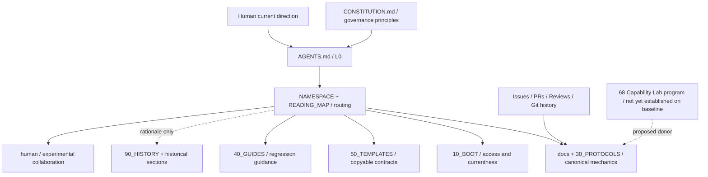
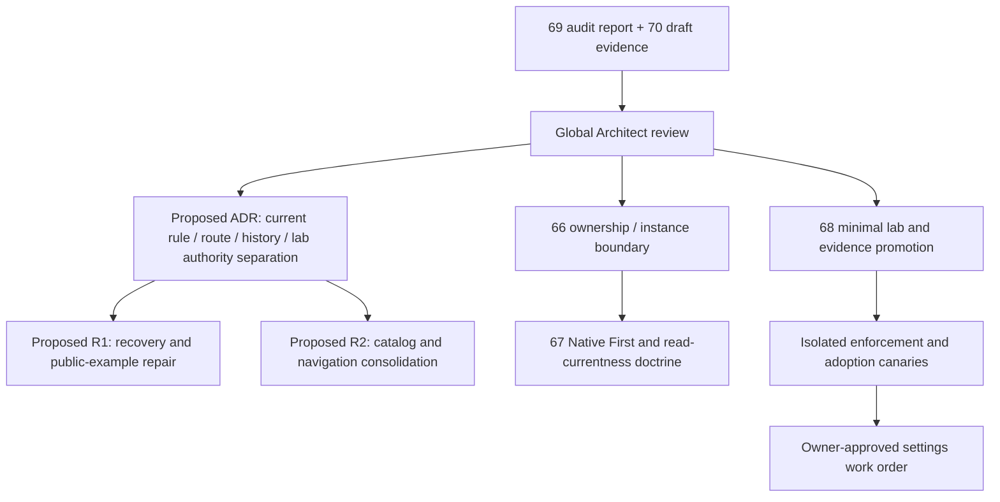

# ASTRA_AI_USE_CONSTITUTIONAL_AUDIT_REPORT

Artifact Version: 1.0.0
Work Order: [ai-use#69](https://github.com/youling/ai-use/issues/69)
结论：**REFACTOR**。保留 L0 的权限、事实、范围、证据与持续执行内核；定向收敛导航、恢复入口、模板与历史边界；以小型、可复现的 GitHub Capability Lab 补上能力证据和平台执行层。当前没有证据支持全仓推倒重建。

状态：`AUDIT_DELIVERED / GLOBAL_REVIEW_PENDING`。本报告、工具、指标与建议均为非规范性审计产物。`NORMATIVE_REWRITE = HOLD_PENDING_GLOBAL_REVIEW`。不把完成审计、跑通 canary 或拥有 GitHub 权限当作修改宪法 main 的授权。

## 1. 审计基线、窗口与证据口径

唯一正文基线：[main@345184f19bc5e1546c86e6c9e234d5c653437747](https://github.com/youling/ai-use/tree/345184f19bc5e1546c86e6c9e234d5c653437747)。47 个 tracked files 均已读取，未从旧 Issue 推断目录。REST recursive tree 返回 `truncated:false`，47 个 blob 的 path/SHA 与本地 Git 清单完全一致，见 [API 收据](evidence/api-canaries.json)。

主要仓库元数据采集：2026-09-20 11:00:51–11:01:11 UTC；第一轮 Actions：11:06:35–11:07:00 UTC；REST/GraphQL/ETag：11:09:24–11:09:36 UTC；关系实验：11:10:28–11:10:39 UTC。北京时间加 8 小时。历史抽样覆盖 2026-08 的内核/启动收敛至 2026-09-19 的 #65。不同 API 读取不是事务快照；冻结文件结论不随后续 main 漂移自动变成 current。

证据词汇按 #69 使用：`DOCUMENTED_CURRENT` 是本轮官方资料；`OBSERVED_AVAILABLE/BLOCKED` 是指定凭据/环境的观察；`SYNTHETIC_CANARY` 是合成实验；`MEASURED` 是可复现机械测量；`REAL_REPO_CANARY` 是真实本仓只读路径实验；`PRODUCTION` 需对应 owner-local 接受，本轮没有；`ASSUMPTION/UNKNOWN` 明示未证明事项。这些是不同维度，不是从低到高的单一成熟度阶梯。

本报告的语义判定为单一审计者的逐文件 review；机器 checks 不证明语义正确。未运行多模型或独立 fresh-agent 行为评测。五类 downstream 采用明确场景的桌面 walkthrough，不能冒充真实项目生产验收。

## 2. 当前仓库架构图



图为本审计的 `DERIVED` 导航，箭头分别标出规范来源、阅读路由、证据输入，不把目录或图的位置解释成新 authority。逐文件坐标、Git blob/digest、大小见 [inventory.json](evidence/inventory.json)，处置见 [逐文件评审](ARTIFACT_REVIEW.md)。

当前是“逻辑编号层 + 保留的 docs/ 实体位置”：`20_ROLES` 只有入口；核心 Agent Interface/Reconnaissance/Session 仍在 `docs/`；`30_PROTOCOLS` 仅放部分协议。这不构成所有权错误，但物理路径不能直接回答 canonical home。没有 `.github/`、代码验证器或 machine-readable lab index；本审计分支新增的内容不能回算为 baseline 已具备。

## 3. Artifact 清单与 authority map

| 审计分类 | 文件数 | authority / 用法 |
| --- | ---: | --- |
| L0 Kernel | 1 | AGENTS.md 3.0.0，跨角色最低不变量 |
| L2 normative / playbook | 24 | canonical 协议、模板、专项规则；其中有历史段落，不能整文件等同当前规范 |
| navigation / mixed | 10 | 路由、README、入口；部分文字本身规定行为，不能全部按无语义维护处理 |
| test reference | 4 | 1 份 cold-start checklist、3 份 Depositor 案例；描述测试，不是自动执行测试 |
| history / rationale | 7 | 3 ADR、历史索引、2 provider/incident 文档、旧 Prompt；分类含审计判断，部分文件未自标 historical |
| License | 1 | 原许可文件保留；本审计不改变许可 |

合计 47。L1 是当前 role/task/owner-local context，并非一定要有一个常驻 L1 文件目录；不能据此说“缺 L1”。阅读的 L0–L3、变更等级的 L0–L2、图示下钻的 L0–L4 是三个不同坐标系；建议机器字段分别称 `reading_level`、`change_level`、`view_depth`，不必为消歧重命名所有历史文档。

当前 authority 应这样读：Human 当前明确方向 → current durable global governance / L0 不变量 → owner-local contract 与 scope 内 Architect 裁决。事实来源负责证明“现在是什么”，不是授予“可以做什么”。Constitution 对部署控制面的来源说明、公共 ai-use 编纂正文、部署本地 ruling 应显式标明 provenance/applicability；不得要求外部读者访问上游 private control plane。[当前 Constitution](https://github.com/youling/ai-use/blob/345184f19bc5e1546c86e6c9e234d5c653437747/CONSTITUTION.md#L7)

`Capability != Authority`、Human override、merge/deploy 分离、低风险 DIRECT、最多一个普通 fresh Verifier、Incident 才扩验证、独立性不能由 fork/self-review 冒充，均有明确 canonical home；没有发现足以废弃这些内核语义的证据。详细机制下沉基本成功，L0 仍混入具体编号链、中文默认及指针表，但属于已接受设计选择，不应以本审计自行删改。[AGENTS.md](https://github.com/youling/ai-use/blob/345184f19bc5e1546c86e6c9e234d5c653437747/AGENTS.md)

## 4. 冷启动、读取成本与恢复路径

| 明确的 whole-file 场景 | 文件数 | Git blob bytes |
| --- | ---: | ---: |
| 仅 Kernel | 1 | 7,430 |
| Kernel + Namespace + Reading Map | 3 | 27,568 |
| 上述 + Bootstrap + Agent Interface | 5 | 59,993 |
| material Architect 再加 Reconnaissance / Constitution / Change Lifecycle | 8 | 91,176 |

这是指定文件集合的测量，不是所有任务的 mandatory read，也不包括 owner-local rules/Work Order；按章节 targeted 读会更低，触发额外场景则会更高。本轮不将 UTF-8 bytes/4 冒充 tokenizer 计数，也未测真实模型耗时或成功率。[测量与方法](evidence/measurements.json)

最明显的成本是：两个 router 共 20,138 bytes，已达 Kernel 的 2.71 倍。L0、Namespace、Reading Map、START_HERE、00_KERNEL README 都重复解释 kernel-first/zero-prompt/fault containment；这些不是五个不同职责。建议保持现有链式语义，把 Namespace 缩成薄兼容入口，由单一 scenario catalog 生成各阅读视图。不要把 00→90 改成 mandatory full-read，也不要在本轮删除 Human 已明确保留的链。

当前 Warm/Fresh/mode/independence 与 `PREMATURE_YIELD` 分离合理；恢复能从 current Issue/head/checkpoint 重建，不依赖长聊天。主要失败入口是 handoff 模板主动引用旧 Fast Restore；新旧规则虽然有冲突优先级，读者仍需先摄入错误流程再隔离。这个反复修补成本应通过入口重构消除，而不是继续扩 L0。

## 5. 主要发现、矛盾与冗余

以下严重度是审计优先级，不自动等于 Incident。证据来自冻结正文及收据；未作未授权的生产破坏测试。

| ID / 优先级 | 观察与影响 | 证据 / 不能证明的范围 | 建议 |
| --- | --- | --- | --- |
| F01 / P1 | `architect_handoff_check` 仍固定要求旧方 handoff artifact、Human 确认，并调用 Session §5；事务流程把 Bootstrap 放在 ACCEPTED 后。旧 Session §5 要扫全部 OPEN、先等用户确认。对 missing-old-session、已获授权的 takeover 会产生假阻塞或顺序歧义 | [handoff check L28](https://github.com/youling/ai-use/blob/345184f19bc5e1546c86e6c9e234d5c653437747/50_TEMPLATES/architect_handoff_check.md#L28)、[transaction L15](https://github.com/youling/ai-use/blob/345184f19bc5e1546c86e6c9e234d5c653437747/50_TEMPLATES/architect_handoff_transaction.md#L15)、[Session L210](https://github.com/youling/ai-use/blob/345184f19bc5e1546c86e6c9e234d5c653437747/docs/SESSION_LIFECYCLE.md#L210)。Reading Map compatibility note 已降权；因此不是旧文字仍有权覆盖 L0，而是活入口没有消除误用 | 合并 canonical recovery/handoff 判定；显式区分 planned transfer 与 crash takeover；旧全文迁历史并留 forward pointer |
| F02 / P1 | 公开、可复制的 DISPATCH_PAIR 示例含具体私仓 Issue/comment/head 与设备标识，与 Agent Interface §5 的 generic coordinate 要求不一致 | [template L70](https://github.com/youling/ai-use/blob/345184f19bc5e1546c86e6c9e234d5c653437747/50_TEMPLATES/DISPATCH_PAIR.md#L70)。不在本报告再抄具体值；是否曾由 Human 同意公开 UNKNOWN；不能仅凭这些引用判 secret 泄露 | 当前模板换 inert fixtures；历史保留 provenance，不擅自重写 Git 历史；公开实验只用合成值 |
| F03 / P1 | Workspace Bootstrap 固定要求把 topology registry 存 governance repo，与共享公共宪法/公共 Lab + private deployment 的组合缺少清晰存储分支 | [Workspace L53](https://github.com/youling/ai-use/blob/345184f19bc5e1546c86e6c9e234d5c653437747/10_BOOT/WORKSPACE_BOOTSTRAP_PROTOCOL.md#L53)。private fork 本身可安全，不能推断现有实例已经泄漏 | #66 明确 semantic owner、deployment registration pointer、private storage overlay；public governance 不默认接收实例 registry |
| F04 / P1 | provider 专项旧指南未明确 retired，却允许新文件直接写 main；把一次空且 incomplete 的搜索推广成整个 private search 不支持；还给出无条件开自动执行的设置建议 | [旧指南 L46](https://github.com/youling/ai-use/blob/345184f19bc5e1546c86e6c9e234d5c653437747/docs/DeepSeekPP-github-mcp-usage.md#L46)、[L108](https://github.com/youling/ai-use/blob/345184f19bc5e1546c86e6c9e234d5c653437747/docs/DeepSeekPP-github-mcp-usage.md#L108)、[L222](https://github.com/youling/ai-use/blob/345184f19bc5e1546c86e6c9e234d5c653437747/docs/DeepSeekPP-github-mcp-usage.md#L222)。本轮公开 repo 也返回 0 + incomplete，故旧因果归纳不成立；未证明所有 private 搜索路径都可用 | RETIRE 其当前指南身份；保留截断事故作为历史 donor；provider 当前行为转 capability evidence |
| F05 / P1 | 要求 PR-first/exact-head，但 main 无 protection、ruleset、checks；属于 PROCESS_GUARDED | [平台快照](evidence/platform-snapshot.json) + Change Lifecycle §4。未测试 direct push，不声称所有绕过路径已实测；未证明现有维护者不遵守流程 | 先定义治理 acceptance 如何映射 Checks/Review，再做隔离规则 canary，最后由有权 owner 批准 main 设置 |
| F06 / P2 | 新公开 `human/README` 的冷启动链直接从该 README 开始，未指向 L0/Bootstrap；当前 Depositor Prompt 与版本治理/旧测试的 prompt-only 结果也漂移 | [human L30](https://github.com/youling/ai-use/blob/345184f19bc5e1546c86e6c9e234d5c653437747/human/README.md#L30)、[版本治理 L71](https://github.com/youling/ai-use/blob/345184f19bc5e1546c86e6c9e234d5c653437747/human/PROMPT_VERSIONING.md#L71)。0.1.3 区分 SOURCE_CONTEXT_UNAVAILABLE 与 NO_DEPOSIT_NEEDED，旧案例是历史观察；不能据此宣称当前 prompt 回归已通过 | 给有工具写入场景加 L0 routing；当前测试与历史失败分开；#43 仍 OPEN/未接受，不把 0.2.0 当 main |
| F07 / P2 | 两个 router、多个入口重复 full mechanics 解释；“不要重复 mechanics”仍需要读者判断何为 summary/template/actual contract | [测量](evidence/measurements.json)、Reading Map / Namespace。重复 invariant 有容错价值，不能把每处相同短语都当 defect | 一个手审 scenario catalog；其余薄入口/生成视图；保护稳定路径 |
| F08 / P2 | Handoff、context machine 枚举等长期语义在 templates 里定义，而多处声称模板只提供形态；canonical ownership 不完全自洽 | Context Mode Seed 正交维度/安全冻结、Handoff Transaction；ADR-0002 明确接受此 seam，因此不是未授权规则 | 要么将该类标明 canonical contract，要么迁语义至协议，模板只生成；不得在迁移时更改枚举 |
| F09 / P2 | `40_GUIDES/README` 仍引用 L0 已不存在的 Secrets & output 小节；历史索引漏 ADR-0003；START_HERE 的 Alignment Template 指到 Constitution §1，但那里没有该模板 | [guide L7](https://github.com/youling/ai-use/blob/345184f19bc5e1546c86e6c9e234d5c653437747/40_GUIDES/README.md#L7)、[history index](https://github.com/youling/ai-use/blob/345184f19bc5e1546c86e6c9e234d5c653437747/90_HISTORY/README.md)、START_HERE Common Operations。文件存在性绿灯发现不了章节语义漂移 | 导航清理 + section/anchor check；无须大改命名空间 |
| F10 / P2 | #65 等 Issue/PR/Review 长段人类叙述使用英文；英文 Work Order 不是既定 language override | [#65 Review](https://github.com/youling/ai-use/pull/65#pullrequestreview-5257513697)、Language Policy。未检出本抽样中的 explicit override；不对未读私有 Human 指令作不存在断言 | 默认中文回写检查、readback；不将此类文风问题混同 authority 缺失 |
| F11 / P2 | #61 PR body 仍列旧 reviewed SHA 和旧 §11 指针，最终 APPROVED Review 已绑定修复后的 head/§10；读 PR body 会误读状态 | [#61](https://github.com/youling/ai-use/pull/61)。最终 review 证据完整，所以不是 stale head 被合并的证据 | 修改后刷新 PR 摘要；以 machine `head_sha` 与 review.commit 为判据，正文旧声明标历史 |
| F12 / P2 | #68 仍是 program 设计，缺 machine index、刷新/失效规则、可恢复收据、fixture 生命周期；#67/#66 尚未编纂，不能被 downstream 当已实施协议 | [baseline work](evidence/baseline-work.json)、47 文件清单、#66–#68。proposal 的存在不证明实验室 established | 小 schema + canary harness + exact-head review 后建立；扩展 canonical protocol 走独立 L2 审查 |

另有 L2 变更判级歧义：#54 新增跨项目 diagram authority/currentness 约定却按 L1 无 ADR；现有 Durable Data 已有 DERIVED 原则，可解释为兼容扩展，因此记 `NEEDS_ADJUDICATION` 而非直接宣判违规。#65 的 batch execution 为既有生命周期的执行方法扩展，L1 理由充分；不能因其“重要”机械要求 ADR。

## 6. Self-dogfood 与历史对账

抽样为 #50 引入 Change Lifecycle 后、至基线 #65 的全部 8 个 merged PR，包含 PR body、files/commits、原生 reviews、timeline 和 review comments。不是挑选几个好例子。[机器明细](evidence/pr-compliance.json)

| PR | 最终 head（缩写，完整见明细） | 合并前最终 head Review | ADR / 判级 |
| --- | --- | --- | --- |
| #50 | 2bdc5d8 | COMMENTED / ACCEPT | L2，ADR-0001 |
| #52 | 4b8c556 | COMMENTED / PASS | L1，Seed 既有不变量加强 |
| #54 | bbd8c74 | COMMENTED / PASS | L1，自称兼容；建议核准界线 |
| #56 | d22f9b0 | COMMENTED / PASS | L1，图的摆放规范 |
| #58 | d863a95 | COMMENTED / PASS | L1，图质量与容量证据区分 |
| #61 | a2a689b | APPROVED / ACCEPT | L2，ADR-0002；先 REQUEST_CHANGES，修复后重审 |
| #63 | 30b59c9 | COMMENTED / ACCEPT | L2，ADR-0003 |
| #65 | 0497ffe | COMMENTED / PASS | L1，有明确 no-ADR rationale |

8/8 有同最终 head 且早于 mergedAt 的原生 Review 记录；7 COMMENTED、1 APPROVED；8/8 checks 为空；三件明确 L2 均有 ADR。所有样本均能恢复 rationale Issue。COMMENTED + exact-head 接受是可观察的 durable logical ruling，但不是 GitHub required approving-review gate；同一物理 principal 的限制在历史 #21 和 #63 有明确说明。不能机械安装“必须一个 APPROVED”然后假设当前单账号流程还能运作。

这些证据证明审查绑定与闭环有实际执行，尤其 #61 的三项语义缺陷被发现、修复、重新接受。不能证明 Reviewer 的认知上下文独立，也不能从 Review 正文反推出当时 merge API 实际携带 expected-head；这些保留 UNKNOWN。无需为了本报告再假装独立审查所有旧 PR。

| 历史节点 | 为什么引入 / 今天还成立的理由 |
| --- | --- |
| [#16/#19](https://github.com/youling/ai-use/issues/16) | 普通 merge 等 Human 的瓶颈；以 current delegation + exact-head 取代人类逐步操作，同时保留 deploy 独立 gate |
| [#17/#18](https://github.com/youling/ai-use/issues/17) | 中文漂移与先读任务后读 L0；ADDRESS/APPLICABILITY/EXECUTION 三分仍有价值 |
| [#21/#22](https://github.com/youling/ai-use/issues/21) | 低风险工作不应强制多 Agent 接力；DIRECT 条件与已有 acceptance 防自证 |
| [#23/#24](https://github.com/youling/ai-use/issues/23) | 只恢复内部历史会错过当前外部能力；ARCH-0 保留，平台能力 pass 适合接在这里 |
| [#27/#29](https://github.com/youling/ai-use/issues/27) | 已有权且有下一步仍等“继续”；持续执行规则不是无限工作授权 |
| [#30/#31](https://github.com/youling/ai-use/issues/30) | 真实 web cold-start 暴露入口、writeback、continuation 漂移；说明 router 需要行为 canary |
| [#33/#34](https://github.com/youling/ai-use/issues/33) | outsider portability；Human 明确保留可短路的 00→90 链。#33 仍 OPEN，应澄清剩余 scope，不能仅凭 open 自动继续旧施工 |
| [#35/#36](https://github.com/youling/ai-use/issues/35) | L0 机制过多；residency relocation 曾发现 4 项真实语义回归。支持保留内核、不做无证据全量重写 |
| [#49/#50](https://github.com/youling/ai-use/issues/49) | 文档也是 Agent 行为输入；STRICT/PERIODIC 是按风险降 ceremony 的合理分流 |
| [#53/#55/#57](https://github.com/youling/ai-use/issues/57) | 图示 dogfood 暴露呈现失败被误报容量不足；保留证据分层，renderer 特定经验下沉 guide/lab |
| [#59/#60/#61](https://github.com/youling/ai-use/issues/59) | red tests + legal next 却 yield；保留 warm repair、fresh independence、acceptance-derived finish |
| [#62/#63](https://github.com/youling/ai-use/issues/62) | 外部 runtime 增加第二 state track；复用看总体复杂度，不能机械用 LOC 或 star 数裁决 |
| [#64/#65](https://github.com/youling/ai-use/issues/64) | 逐文件远端编辑导致 commits/CI thrash；plan-first + batch justified。本轮 native tree batch 也实证可用 |

上述历史证明“为何引入”与公开审查轨迹，不把 donor 对私有事故的描述提升为本轮独立验证过其全部现场。前 #50 的修改不追溯套用后来的 ADR 要求。

## 7. GitHub-native capability matrix

表内平台现状来自 [快照](evidence/platform-snapshot.json)，实验来自 §8；“不用”不自动是缺陷。所有 native state 只有在 owner contract 明确指定字段/对象时才有领域权威。

| 能力 | 当前观察 / 分类 | 语义适配、权限、失败与恢复 |
| --- | --- | --- |
| Issues / Forms | Issues 已用；baseline 无 Forms，UNDERUSED | Issue 放 rationale/acceptance，Form 可帮助分级/公开素材确认，不要求每个小修填长表；需写 Issue 权限；模板不是执行授权；元数据须另行导出 |
| labels / milestones | 14 labels，少量使用；0 milestones | labels 可筛选；有 owner contract 才是 lifecycle source。Milestone 只在确有共同时间窗时使用；不为完整性创建 |
| sub-issues / dependencies | #66–#69 仅 prose 关系，原生关系为空；合成往返 PASS | native 关系适合 decomposition/blocking，不能推导 authority、acceptance 或自动调度；保留 ID/URL，reconcile 丢失或变更。公开同仓实验不能证明跨私仓权限。[API](https://docs.github.com/en/rest/issues/issue-dependencies) |
| PR / Reviews | USED；最终 head 审查 8/8 | PR 为 transaction，Review 与检查分别证明语义/机械性质；COMMENTED 不满足 APPROVED 平台门；新 head 必须重新绑定；导出 review.commit/timeline |
| Checks | baseline 0，UNDERUSED | path/link/version/public-fixture lint 适合 native checks。先有可信验证器再设 required；不能用作者可任意改写的脚本绿灯代替独立治理审查 |
| Actions / reusable / matrix | baseline 0；本轮 Linux/Windows + reusable PASS | 标准 hosted runner、最小权限、固定 SHA；bounded timeout，错误要收集完整集合后 batch repair。runner 镜像可变，收据记录环境；单 run 不证明可靠性。[Workflows](https://docs.github.com/en/actions/concepts/workflows-and-actions/workflows) |
| artifacts | 合成 upload/download PASS | 验证产物短期分发；到期可删，长期摘要/digest/manifest 要入 Git 或独立 custody；artifact 包摘要不等于内部文件摘要；本轮 retention 7 天 |
| cache | baseline 0；DEFER | 本仓无昂贵依赖下载，不值得增加缓存。若以后采用，cache miss 应可重建；跨 branch/低信任恢复有污染和暴露风险，不存私有数据/秘密。[cache](https://docs.github.com/en/actions/concepts/workflows-and-actions/dependency-caching) |
| concurrency | 仅 workflow 配置，UNKNOWN contention | group 限制同类实验，可 cancel 旧验证但不得把被取消当通过；不是互斥锁/业务顺序保证。需双 run 竞争 canary 才证明实际行为 |
| protection / rulesets | main protected=false，rulesets=[]，UNDERUSED | public repo 可用规则不等于本轮可改 main。先定义 approver/check/bypass/actor contract，隔离分支验证 stale head、bypass、恢复后再审批启用。[rulesets](https://docs.github.com/en/repositories/configuring-branches-and-merges-in-your-repository/managing-rulesets/available-rules-for-rulesets) |
| CODEOWNERS | baseline 无，CONDITIONAL | 可路由 review，但不能表达 logical Architect authority；搭配 required code-owner approval 才有平台阻断。先解决物理账号/逻辑角色映射，不机械指派新账号 |
| merge queue | owner.type=User，UNSUITABLE 当前拓扑 | 官方可用范围要求 organization-owned public，或相应 Enterprise private；不能为本仓低流量审计而迁组织。owner/topology 改动独立 Human gate。[merge queues](https://docs.github.com/en/pull-requests/concepts/deploying-code) |
| auto-merge | allow_auto_merge=false，DEFER | 可减少等待，但仍受 exact-head/review/check/authority 约束；基线未建立平台门时不优先启用，不产生 deploy authority |
| Projects v2 / fields / views / roadmap | query 报 INSUFFICIENT_SCOPES；OBSERVED_BLOCKED | `has_projects:true` 不证明 V2 可读或可写；需 read:project，未扩 scope。适合 active-work projection，不是永久 domain row 镜像；Human/Agent suggestion/derived 字段分开；scope/admin gate 后 synthetic field/reconcile。[Projects API](https://docs.github.com/en/issues/planning-and-tracking-with-projects/automating-your-project/using-the-api-to-manage-projects) |
| tags / Releases / source archives | 0 tag / release；ADAPT_NATIVE 候选 | exact Git SHA 已可定位源码，source archive 不带 Issues/Reviews/配置。Release 可配送批次证据，但不是 canonical 写权；先证明消费者需要，再引入 release cadence/manifest；不要求每 commit 发版 |
| Packages / attestations | 未生产，UNKNOWN / DEFER | 当前纯文档不需要 package。后续分发可执行生成器时再评估；attestation 证明 build provenance，不证明结果正确/被授权/私有适配。需要对应 permissions，未探测或扩展。[attestations](https://docs.github.com/en/actions/concepts/security/artifact-attestations) |
| REST / GraphQL / ETag | pagination + 304 已实测 | native API 是读取 seam；完整性看 Link/pageInfo/truncated/errors，不看第一屏为空。304 需有对应本地缓存，gh 非零退出不能盲判失败；API 版本、scope、过滤条件纳入收据。[REST best practices](https://docs.github.com/en/rest/using-the-rest-api/best-practices-for-using-the-rest-api) |
| Git tree / native code search | exact tree PASS；search 0+incomplete | 搜索适合发现，不能证明集合完整或 absence；exact tree/Git 才用于文件审计。搜索返回误差不能推广成 public/private 产品禁用结论。[search API](https://docs.github.com/en/rest/search/search) |
| GitHub App / webhooks | hooks=[]；新 App 未授权，DEFER | webhook=hint，live reconcile+idempotency+scheduled/on-demand repair；delivery state 可缓存，不存唯一领域真值；安装/权限/公网接收端是独立 gate，不为 polling 偏好先建 App |
| secret/dependency/code security | secret scanning + push protection enabled；alerts 返回 0；Dependabot disabled；code scan no analysis；SBOM 404 | 扫描 secret ≠识别私有业务事实。无依赖/代码时不机械加 CodeQL；新增 Actions 后适合依赖 pin/review/更新检查。404 不推断完整产品不可用；零告警不是无泄漏证明 |

本轮官方 [GITHUB_TOKEN 触发说明](https://docs.github.com/en/actions/how-tos/write-workflows/choose-when-workflows-run/trigger-a-workflow) 还明确区分：一般 token-triggered events 不递归触发，而 PR opened/synchronize/reopened 可产生待批准运行。旧式“一切 token 事件绝不触发”过强。本轮只测试显式只读 token，未测试该 PR 事件例外；入 Lab 时应存 feature-specific source 与最小 canary，避免靠记忆冻结平台规则。

## 8. GitHub-native canary 结果

| Canary | 结果 / 证据 | 实证边界 |
| --- | --- | --- |
| C1 exact tree | 47 blob path/SHA 与 Git 一致，truncated=false；[receipt](evidence/api-canaries.json) | MEASURED；只证明此 SHA tree，不证明 live GitHub metadata 同一事务一致 |
| C2 hosted matrix/reusable/artifact | 1 run、3 jobs SUCCESS；[run 35506914634](https://github.com/youling/ai-use/actions/runs/35506914634)，[digests/expiry](evidence/actions-receipt.json) | SYNTHETIC_CANARY；Linux/Windows 相同 inventory/measurement/link payload；本地下载再次比对。未测 fork/cache/contention/attestation |
| C3 token negative | contents GET 200；对审计 head status POST 403 | SYNTHETIC_CANARY；仅该 job token。public read 不证明 private read；403 不证明所有资源类别不可写 |
| C4 pagination / ETag | REST 8 页（7×2+空终页）、GraphQL 7 页，14 IDs 一致；条件 GET 304 | REAL_REPO_CANARY；只读本仓 labels/metadata，不模拟并发写入、429、丢页恢复或复杂 ACL |
| C5 native relationships | sub-issue 添加/parent 读回/移除，blocked_by 添加/读回/移除均 PASS；[#71](https://github.com/youling/ai-use/issues/71)、[#72](https://github.com/youling/ai-use/issues/72) 已关闭；[receipt](evidence/relationships.json) | SYNTHETIC_CANARY；仅同仓两条合成 Issue，不证明跨仓权限、cycle prevention、调度语义或 original-ID restore |
| C6 search incomplete | 0 hits + incomplete_results=true，精确文件实有匹配 | OBSERVED_AVAILABLE（接口）+ UNKNOWN（检索完整性）；不能拿空结果证明无规则/无复用实现 |
| C7 publishing route | HTTPS push 因缺 workflow scope 被拒；既有 native connector 批量 tree/commit/ref 成功 | OBSERVED_BLOCKED/AVAILABLE 分别绑定 route；未扩 scope。两套凭据能力不同，不构成新增治理 authority |

实验脚本的中间失败也保留为方法限制：最初 GraphQL 误用了 Label.databaseId，服务端明确报字段不存在，改用 REST node_id / GraphQL id；最初把 gh 的 304 非零退出当失败，随后按 HTTP 语义处理。这些是审计客户端缺陷，不是 GitHub 能力不可用。终端中文乱码亦已通过 UTF-8 原始 JSON 核对排除，不能算仓库数据损坏。

## 9. #67 GitHub Native First 评估

**REFINE 并实施其 targeted L2 方向**，不另造一套主宪法。#67 对 canonical truth、intake、transaction、projection、validation、distribution、events、derived reads、DR 的分层语义适配良好；禁止第二 SSOT、事件后 live reconcile、native metadata DR 分离都有充分理由。

ARCH-0 在 material subsystem 选择时增加两问即可：“GitHub 是否已解决通用部分？”“ai-use 是否已有同 scope/current 的 canary？”再记录 `REUSE_NATIVE | ADAPT_NATIVE | DERIVED_PROJECTION | CUSTOM_REQUIRED | DEFER | REJECT` 和 owner-local delta。ordinary bug/Hot Resume 不增加扫描。Native adoption 不是新的 authority，也不豁免 mature-core seam/admission；GitHub 已在使用的协作平台能力与引入新 runtime 不是同一迁移成本。

建议最多一份新 `30_PROTOCOLS/GITHUB_NATIVE_FIRST.md`；DDD、Reconnaissance、Diagram 的不同职责各做最小扩展。Privacy 方法若确实独立才设专项协议，不能将 #67 的长 Issue 整段复制进五个文件。其 #66 owner/instance boundary 是前置语义协同，不是扩大 public topology 的许可。证据：#67 本体及 Global extraction comments；不能证明已落地，baseline 尚无该协议。

## 10. #68 Capability Lab 设计评估

方向 **KEEP**，首批设计 **REFINE_BEFORE_SCALE**。现有 Issue 已具实验/规范分离、synthetic-first、owner-local adoption、admin gates，足以开始有界实验；尚不足以称 established：没有当前索引、版本/失效/晋升/fixture lifecycle 的实物验收。

建议最小 capability record：`capability_id`、`question`、`owner`、`official_sources + checked_at`、`environment {public/private, principal_type, permission_class, plan-if-known, API version}`、`fixture_revision`、`run/check`、`source_revision`、`artifact_manifest/digest/custody`、`observed/expected`、`evidence_classes[]`、`limits`、`invalidated_by/revalidate_before`、`promotion_status`、`adoption_delta`。不存 credential、账户全权限快照、私有 topology 或完整聊天。

证据种类、实验环境、治理晋升状态用三个字段，不把 SYNTHETIC→PRODUCTION 当自动状态机。`proposed -> canary-recorded -> reviewed reusable -> adopted by owner` 每一步保留接受者/范围；失败/失效也是有效结果。超出权限、分页未完、source/header 不匹配、artifact 丢失等必须将对应 claim 标 UNKNOWN/STALE，不能只更新 verified_at。

fixture 使用 `audit/lab` branch、draft PR、受限 workflow、合成 Issue 标记、cleanup plan；只执行显式 allowlist，禁止 pull_request_target 跑不可信 head。短期 artifact 到期前将关键摘要与最小可复现输入入 Git，原始大 payload 独立 custody。下游先读小 index → 一条 claim → exact fixture/receipt → owner-local delta；回流只接受已去除实例信息的泛化结论。

Lab 需要独立 **schema version / fixture revision / evidence revision**；目前无 evidence 表明必须另建 release service 或每条结果发 Release。等有多个 pin-version 消费者，再按批次发布 release manifest。现有 Git commit 足以启动。审计提供 [capability-index 原型](evidence/capability-index.json)，它明确是 `AUDIT_ONLY / UNREVIEWED`，不是 #68 已完成验收。

## 11. Durable Data / Current Read / freshness

DDD 的七问题（identity/semantics/provenance/immutability/derivation/retention/migration）应 **KEEP**；不全球化 Assets schema、SQLite 或存储产品。当前 derivation/rebuild 提法正确，但尚未给 bounded read/currentness/三类恢复的可操作最小契约。[DDD baseline](https://github.com/youling/ai-use/blob/345184f19bc5e1546c86e6c9e234d5c653437747/docs/DURABLE_DATA_DOCTRINE.md)

建议 #67 扩展可复用方法：历史存储成本与当前读取成本分别预算；tiny catalog 指向 targeted records；一个 reviewed interpretation boundary 生成 index/snapshot/graph；输出携带 exact source revision、解释器版本、coverage 与 digest。snapshot build 时间不能代替 query target 的 currentness：旧 snapshot 仅在有完整 delta proof 时回答更晚 target；丢页、截断、errors 或未知 coverage 直接 fail closed。

恢复分三类：Git mirror 恢复 canonical blobs/history；metadata export 恢复 Issues/Reviews/labels/relationships/settings 的可重建意义，不能保证原 ID/作者/时间原样回放；外部 payload/secret custody 需要独立备份恢复。恢复 metadata 时保留 old→new ID mapping 和 source pointer，不将“文件能 clone”宣称“整个系统可恢复”。本轮 C4/C6 已证明完整性语义必要；没有模拟大规模 snapshot/delta/灾备，因此算法/容量/恢复 SLA 仍 UNKNOWN。

## 12. Diagram-as-Code / Navigator

**KEEP authority/currentness/drill-down；REFINE interpretation boundary；REFACTOR 工具细节驻留。** 当前协议明确 DERIVED、source pointer、动态 freshness、renderer neutrality、机械 PASS 不等于语义/视觉/规模证明，值得保留。这份 499 行文件的 §6 中大量 geometry/provider dogfood 细节可迁 targeted guide/evidence，减少普通架构读者成本；不设任意节点上限。

ai-use 本身有多层路由、history、authority 与 canary promotion，已适合一张小入口图，但不需要 richer UI/runtime。建议从同一 reviewed catalog 生成 Markdown index + Mermaid 文件导航，叶子钻到 exact canonical sections。字面 Markdown 链接只能自动生成“文件引用图”；它不能自动解释 authority/硬依赖/语义等价，关系类型必须手审。index/snapshot/diagram 要比较同一 source revision、同一解释器、同一覆盖范围下的实体/边语义；不是要求不同视图外观或内容逐字相同。

本报告图是手审 DERIVED；[逐文件地图](ARTIFACT_REVIEW.md) 由冻结 inventory 拼接审计注解。本轮没有测 GUI 视觉验收，不把可渲染 Mermaid 当视觉 PASS。

## 13. Privacy / secrets / public-lab 边界

F02/F03/F04 说明“secret scanner 没报警”不能代替公开边界审查。既有公开文档里具体实例引用、local-only 修复现场、认证身份观察应该分别标 example/historical/provenance；不宜继续作为当前可复制 instruction。GitHub 设置显示 secret scanning/push protection enabled、返回 0 alerts；这只说明当前查询结果，不证明不存在 secret、私有事实或历史暴露。

推荐提炼四个跨项目判断：`privacy/access boundary != secret classification`；`secret value != secret reference`；`runtime delivery != recoverable custody`；AI 不自行创造额外永久保密类别。ordinary private facts 按 owner ACL；能授予访问/签名/解密/恢复能力的材料按功能判 secret；Human 可额外保护明确范围的内容；疑似命中可仅对具体材料暂时 fail closed。具体保管/恢复/保留/删除策略仍 owner-local。

公共 canary 的代码、日志、artifacts、cache、Issue、生成图都适用同一个输出边界。本轮只有 inert Issue fixtures、公开本仓 metadata 的白名单摘要、冻结 public docs 清单；不上传原始账户查询、私有下游资料、token/env。对历史中潜在敏感内容，不自行改写历史或建议凭空轮换；由 owner 对确切材料作授权/处置判断。未做全 Git 历史 secret forensic，故不出“全仓无秘密”结论。

## 14. 五类 downstream Project Architect usability

方法：五张合成任务卡，从冻结 L0 + Reading Map 路由，逐题桌面核对；不需要、也未复制任何私有项目实现/拓扑。答案是当前规范能支持什么、缺口是什么。`SYNTHETIC_SCENARIO / ANALYST_WALKTHROUGH`，不声称 independent fresh model 或真实 downstream canary。

| 类别 / 合成任务 | 哪些全球规则适用 | 可忽略什么 | 优先复用的 GitHub 能力 | owner-local 必须设计 | done/current/production 的证据 |
| --- | --- | --- | --- | --- | --- |
| infrastructure/platform：受限执行器改变入口 | L0、Bootstrap、Interface、material ARCH-0、Change Lifecycle；高风险按 Constitution | Human SSOT、无关资产/图呈现细节、全部 portfolio history | Issues/PR/Checks/Actions；events 后 reconcile，#68 同权限 fixture | runtime identity、权限、幂等、fencing、恢复、deploy gate | exact-head tests/review + owner runtime canary；GitHub token PASS 不证明节点生产权限 |
| fact/archive：新增 current-read catalog | L0、DDD、ownership、schema/migration L2 | executor provider 命令、全量历史 ingestion、无关运行环境模板 | Git exact source + Actions materialization；确有分发需求时 Releases | entity/schema、ACL、retention、query completeness、external payload custody | source/generator/coverage/digest + freshness/delta proof；snapshot 时间不是 query current |
| product：修复表单验证 | L0、目标规则、Issue/PR、适用测试；material subsystem 才 ARCH-0 | 无关 DDD、全 Workspace 初始化、每次全外部 scan | Issue Form 可选、PR/checks；不为一个 bug 建 App/Projects | UX acceptance、业务数据、测试环境、部署授权 | 本任务 acceptance 的 checks + reviewed head；PR merge 不等于生产发布 |
| research/evidence：比较两种工具的公开能力 | L0、Reconnaissance、Durable Trace、研究 scope | runtime 运维、强制 release/milestone、完整宪法 | 复用 lab index、hosted matrix、artifact/receipt | 实验总体、尺度、变量、bias、可重复输入、公开素材 | measured vs documented 分离，负例/limits；synthetic evidence 不升 production |
| decision/runtime：依赖事件更新决策输入 | L0、DDD、Interface、material ARCH-0、owner contract | 默认全 portfolio 图、Human Depositor、强制数据库选择 | native dependencies 做 work graph；webhook hint + current API reconcile | 决策权、schema、状态转换、延迟、失效、owner 数据边界 | 不完整输入 UNKNOWN、版本/时序证明、owner-local fault/recovery canary；native edge 不授权执行 |

共同结果：当前四个问题（全球规则、可忽略、local ownership、证据边界）能从已有文档回答，但“先复用哪条 GitHub capability、是否已经 canaried”要自行读 #67/#68 并研究，没有稳定 machine entry。Handoff/历史 section 也让相同职责有多入口。建议用五张卡作为重构前后 representative eval；独立 fresh-agent 的读数/误阻塞率是下一轮 canary，不伪造本轮成功率。

## 15. 定量结果与解释限制

- 47 tracked files、46 Markdown、313,278 Git blob bytes；24 normative/playbook、10 mixed navigation、4 test references、7 historical/rationale、1 Kernel、1 License。完整 blob SHA/digest 是可复核清单，不是自动 normative 判级。
- 普通 Markdown 文件链接（忽略 fenced examples）64 个，0 个不存在的文件目标；未验证锚点、外网与全部引用语法。18 个未解析 backtick path mentions 多为 basename/示例/组合文字，不能按 18 个死链报道。
- 从四个入口通过识别出的 links/backtick references 可达 31 个文件；余下 16 个包含历史、目录索引、human prompt/tests。目录隐式浏览与语义简称不在 parser 中，所以不是“16 个真实孤儿”。人工确认的漏索引是 ADR-0003，human 当前 Prompt 也缺清晰入口。
- 仅 4 组长度至少 45 字符的完全重复行；多数是合理 invariant/reference。语义冗余主要靠 F07/F08 的人工比较，不能用重复字数替代治理判断。
- baseline workflow/run/artifact/cache/release/tag/milestone 均为 0；hooks 0；labels 14；main protected=false、rulesets=[]。Actions 历史可靠性分母为 0，不能算 0% 或 100%；本轮新增 1 个成功 run 是单次可行性证据。
- 最近 8 merged PR：exact-final-head premerge review 8/8，native APPROVED 1/8，checks 0/8；3 个明确 L2 3/3 有 ADR。详细 proof limits 见 §6。

不同 version 数字（AGENTS 3.0.0、Constitution 2.1、Interface 2.4.0、Bootstrap 1.1.0、Change 0.2.0、Diagram 0.3.0、registry schema 1.0.0）主要是不同 artifact 版本，不是“全仓版本不一致”错误。真正问题是缺明确 version namespace/compatibility index，以及已过期的段落引用；不建议强制所有 Markdown 同号或加完整 front matter。

## 16. Security / authority / admin gate 审计

本轮 authority 仅来自 Human 指定 #69 及该 Work Order，角色是 audit executor，不接任 Global Architect。Bootstrap 已 [durable 回写](https://github.com/youling/ai-use/issues/69#issuecomment-5749375805)。初始 gh-first 与读到旧 clone 的顺序偏差已如实记账，随后 current-load 3.0.0、对齐 exact remote 并使用独立 clone；没有借历史 checkout 施工。

凭据差异实测：CLI 可读 admin settings，但 HTTPS 无 workflow scope；native connector 报 push capability 且可批量提交 workflow。既有权限被用于已授权公开 canary，没有新 OAuth/PAT scopes、App 注册/安装、计划升级、组织迁移、外部 credentials、私有资源 mutation 或新公网服务。系统 SSH 路径出现本地 proxy shell 错误后未修改用户配置。

Projects `AUTH_SCOPE_REQUIRED` 和新 App/admin experiments 的 `ADMIN_GATE_REQUIRED` 单独标明；report 可以完成，不把它们当必须扩权的借口。最终 main enforcement 变更需有权 owner 对具体保护规则/approver/bypass/recovery 方案裁决，不将本 audit authority 外推。

## 17. 分域 disposition

| 对象 | 处置 | 依据 |
| --- | --- | --- |
| Human sovereignty / capability-authority / evidence / fail-closed | KEEP | 历史事故与 current owner separation 一致；无替代证据 |
| L0 minimal residency | KEEP，未来可 REFINE 指针生成 | #35/#36 已证明删机制需保语义；本轮不扩内核 |
| Namespace / Reading Map / public entry | REFACTOR | 成本测量、重复 routing、章节漂移；保编号链与路径兼容 |
| Bootstrap + planned handoff + crash takeover | REFACTOR | F01/F03，current 与 historical 调用链错位 |
| DIRECT / warm repair / fresh independence / PREMATURE_YIELD | KEEP | #21/#59/#61 真实问题与修复；不以子代理数量替代独立性 |
| Change Lifecycle / ADR / bulk plan | KEEP + REFINE 分类字段与机械验证 | 有 dogfood，L2 界线与平台门仍需明确 |
| provider stale guides / current-copyable legacy prompts | RETIRE 其当前入口身份 | F04/F06；保留历史证据不删除过去 |
| GitHub Native First | REFINE 并 targeted L2 materialize | #67，已有平台 canary 足以开始，不足以授权所有能力 |
| Capability Lab | REFINE before scale | 建最小 index/fixtures/receipt/currentness，不另造 control plane |
| Current Read / interpretation boundary / metadata DR | REFINE | DDD 已有基础，C4/C6 暴露 completeness 的实际必要性 |
| index/snapshot/diagram 共同派生 | REFINE | 同一语义源减少多轨，自动解析不能取代 semantic review |
| public fixture / private instance boundary | REFACTOR + #66 | F02/F03；保护 reader 与 owner-local facts |
| 全仓改名 / 新 runtime / 新数据库 / org migration | REJECT 当前实施 | 无收益证据，增加 compatibility/authority 成本 |
| Projects / App / merge guard / scale / real fresh-reader outcome | UNKNOWN / NEEDS_CANARY | 明确权限或证据缺口，不出 production claim |

## 18. 推荐目标架构

```text
current Human/global authority
  -> stable AGENTS microkernel
  -> one reviewed scene/canonical-home catalog
       -> short human entry + machine reading map + derived diagram
       -> targeted current protocols / explicitly canonical contracts
       -> copyable templates generated or checked against those contracts
       -> history with superseded/applicability pointers

public capability evidence lane (separate authority)
  question -> official source -> fixture -> receipt/limits/currentness
    -> governance review -> ADR/protocol change when warranted
    -> downstream owner adoption + only unresolved local canary

GitHub operating plane
  Issues/relationships -> PR/review/checks -> reviewed distribution
  settings/enforcement declared separately from prose process
```

这仍是现有宪法模型，不增加中央 task DB、跨项目 runtime、私有事实镜像或自动规范晋升器。catalog 只拥有路由与 applicability metadata；每条协议仍有一个 canonical home。metadata owner 与内容 owner 明确区分。

## 19. Current → Target 迁移图与回滚

| 阶段 / current | target / work boundary | 验收与回滚 |
| --- | --- | --- |
| R1：活 handoff 读旧 Session §5、provider 指南未退休、实例示例 | planned handoff/crash takeover 明确入口；旧正文 history + thin forward pointer；合成示例 | 同一 authority/scope 下旧可接受路径仍可执行；无假 Human gate/私有寻址；逐 PR revert，保历史 |
| R2：多 router / 分散路径解释 | 单一手审 catalog，生成/检查 Reading Map、索引、小图；原 Namespace 成薄兼容层 | 五类场景 + missing/conflicting lower input 回归；记录实际 bytes/误路由；catalog 和视图同 commit，旧路径仍能 forward |
| R3：#66/#67 未编纂 | owner-instance boundary + Native First；DDD/ARCH-0/Diagram 最小扩展 | L2 ADR，no L0 growth、no owner schema import、无私有实例；逐协议版本回退 |
| R4：#68 Issue-only | lab schema 0.x、public fixture allowlist、index/receipts/promotion contract | exact-head semantic review；过期/截断/permissions negative cases；拒绝 release 即回退到 Git refs，不丢规范 |
| R5：流程守卫无 platform guard | 经 owner 批准的 trusted checks + rule configuration | 先隔离 canary 验证 stale head、actor/bypass、自审限制、rollback；未获批准前 main 维持现状 |

迁移按语义批次，不先做全树 rename。只有确有 ≥10 文件 move/refactor 才按 Change Lifecycle §4.1 建 exact-base mapping/bulk plan、一次逻辑 patch、冻结 head 跑 CI。L2 用 proposed ADR，经 Global/Human 当前方向接受后执行；本报告不是该接受事件。

## 20. 建议 ADR / Issue / PR graph



`Proposed R1/R2/ADR` 是待裁决图节点，不是已创建/获批工单；本轮没有擅自拆出生产任务或改变 #66–#69 的真实关系。#66 与 #67 可共享一份受审语义边界，但仍各守 acceptance；#68 实验不等待所有规范写完，规范晋升则必须等 review。先利用已有 Issue，不为每项 measurement 或小清理制造新 Issue。

## 21. Explicit do-not-change

- 不改变 Human final sovereignty、override/revoke、Capability != Authority、owner-local truth。
- 不把 merge delegation 扩展成 deploy/destructive/production permission；不赋 audit executor self-merge。
- 不取消 ordinary high-risk 的 fresh independence，也不强制所有低风险工作多 Agent/多 Review。
- 不把 namespace 链变成 mandatory scan；不以“精简”为名删除 crash recovery、currentness、语言等已接受语义。
- 不复制 Assets schema/SQLite/A-P-S 分类、SecretReference、照片/设备/私有 work state。
- 不把 Release、Project、graph、cache、Chat memory 变成未经 owner contract 承认的新 SSOT。
- 不默认创建 App、升级 plan、迁组织、建外部 endpoint、扩大 scopes、设置自动发布。
- 不改写旧 ADR/PR/Git 历史来隐藏错误；不将未测或阻断的能力标 PRODUCTION。

## 22. 三种 architecture option 与拒绝项

| 维度 | A — KEEP / tighten | B — targeted REFACTOR（推荐） | C — material REDESIGN |
| --- | --- | --- | --- |
| 解决问题 | 修文案/死入口，保现状 | 修重复路由、历史入口、public/private seam、Lab 证据消费与平台门缺口 | 重设目录、规则 DSL、启动模型和全部消费接口 |
| migration cost | 最低，几份文档 | 中等，按语义分批、兼容 forward pointers | 最高，全仓 + 外部指针/consumer 重训迁移 |
| context/read cost | 27.6 KB router 集合大体不变 | 可以只读 Kernel + targeted catalog/section；实际节省必须 canary 测 | 理论可低，但没有新 bootstrap 行为证据 |
| governance risk | 低改动风险，旧漂移继续积累 | 保内核和 gate，受控 relocation 风险 | 同时改变模型与路径，可能重演 #36 的语义丢失 |
| compatibility | 高 | 原路径/枚举兼容；只逐步下沉旧说明 | 破坏依赖方路径、层级和启动心智 |
| 更简单 | 改动少 | 一个 routing interpretation、current/history 分开、小证据索引 | 表面统一目录/DSL |
| 更复杂 | 仍需读者多处 reconcile | 引入小 catalog/generator/fixture 维护 | 新 compiler/runtime/schema + 双轨过渡 |
| rollback | 每个小 PR revert | 每个语义批次 revert，旧 pointer 保留 | 必须整体 compatibility migration/revert，难隔离回归 |
| 为什么不选另两种 | 无法系统消除 F01/F07/F08/F12 | 同时保留已验证内核并处理实证缺口 | 平台功能扩展并未推翻 Human/authority/evidence 内核，无证据抵偿风险 |

拒绝：所有文档都上 L0；所有改动都开 ADR/多 Verifier；把 GitHub Projects 当 domain DB；强制每 commit Release；把 cache/artifact 当 permanent custody；从 prose 自动推导 authority 图；为了“Native First”先装 App/迁组织；认为没有原生 APPROVED 就没有审查；认为有 COMMENTED 接受就已经 PLATFORM_ENFORCED；以本次 canary 替代 downstream local production acceptance。

## 23. UNKNOWN 与最小下一 canary

| UNKNOWN | 最小实验 / gate |
| --- | --- |
| 真实 fresh Architect 读取与误阻塞率 | 5 类相同任务卡 + outsider/no-old-session/conflicting-template；比较 current 与 R1/R2 candidate。使用真正隔离上下文，记录读取清单/bytes/误路由/合法 stop；不靠 fork 名称声称独立 |
| main exact-head platform enforcement 如何适配 logical Architect | 在受限 audit branch 定义具体 actor/check/rule fixture，测 stale approval/head move/direct push/bypass/rollback；需对应 settings authority，不改 main 探路 |
| Projects V2 fields/views/reconcile | gate 获准后，只建两条 synthetic items，区分 Human/derived fields，重复执行、删除事件、partial page、reconcile；不能读取到项目便宣称 views/write 可用 |
| Release/attestation/retention/custody | synthetic payload + manifest + draft release/verify/recover；仅在 repo release 权限明确且无 workflow side effect 后；App/OIDC provider 额外授权 |
| webhook/event loss / concurrency / caches | 不建 App 的离线 event-loss/idempotency fixture先测；需真实 event delivery 时再单独 App/webhook gate；两次 workflow contention 测取消/排队而非设置值 |
| bounded read + stale snapshot delta proof | 合成增删改、漏页、重复页、断流、generator version drift；完整 delta 可 current，不完整必须 UNKNOWN；先不用 SQLite |
| 历史 merge expected-head / fresh cognition | 旧公共记录不能补造；以后保存受保护执行收据、reviewer context lineage/独立性说明；对旧样本维持 UNKNOWN |
| 既有公开实例材料的披露授权 | owner 对确切原路径做 handling review；本报告不扩大转载、不假设所有 reference 都是 secret |

这些未测项已明确答案边界，不阻止本轮报告交付；它们也不被静默标 PASS。

## 24. 最终建议与移交边界

**REFACTOR。** ai-use 的最小不变量仍有事实与历史依据；当前系统的主要缺陷是可发现性、current/history 隔离、模板 contract 驻留、公开实例边界和 evidence consumption，足以定向重构，不足以支持重写宪法模型。

先由 Global Architect review 本报告和 [draft #70](https://github.com/youling/ai-use/pull/70) 的非规范性证据；接受哪些结论、哪些需要 Human direction 后，再冻结 L2 ADR / bounded Work Orders。main 与既有规范正文未由本审计修改。Actions、API、关系 canary 的成功仅在其明确环境/范围内成立；#68 正式 established、任何 protection/Projects/App/production adoption 均未被本报告宣告完成。
